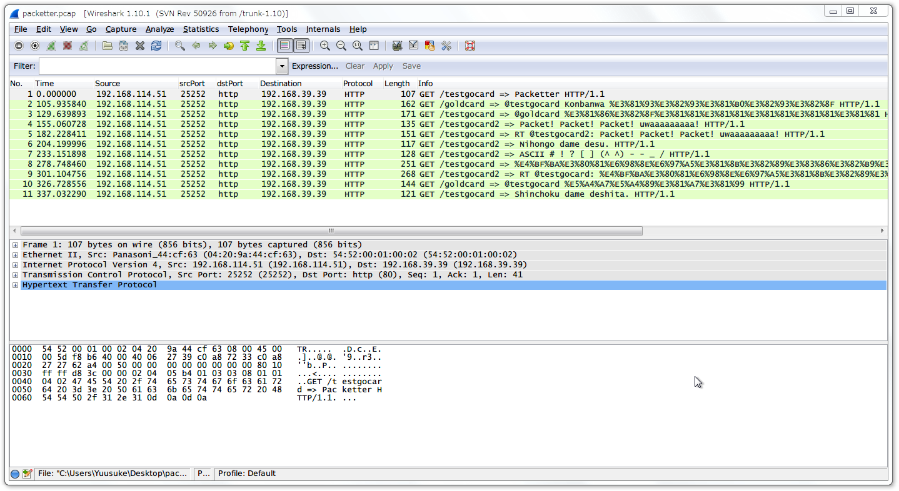

Packetter
=========

なにこれ
--------

twitterのつぶやきをWiresharkの「Info」欄に表示させるRubyスクリプトと、
便利に(?)使うためのWiresharkプラグインです。
Wireshark側のフォントを変えれば、日本語も表示可能です。

[ここ](https://speakerdeck.com/gocard/packetter-1)にちょっと詳しく載っています。

準備
----

0. Linux環境を用意

1. [Trema](https://github.com/trema/trema)を入れる

    * pio が入ればどうでも良いです。
	* でも、Tremaはオススメなので入れましょう。
	* Open vSwitchや、最近のOFSを持っている人は、[Trema-edge](https://github.com/trema/trema-edge)もオススメです。
	* Ryu...?
	
2. tweetstream をインストール

	`$ gem install tweetstream`

3. CONSUMER_KEYなどを設定
	
	`$ cd ./config`
	`$ mv twitter.conf.sample twitter.conf`
	`$ vim twitter.conf`
	
4. ./config/packet.conf を弄ったり

	* `:nw => {`...とか書いていますが、実際のネットワーク環境には影響しません。
	* 作成されるパケットの情報に影響するだけです。
	* そうした意味では、実在しないホストのほうが良いかも?
	

使い方
------

1. 実行

	`$ ruby packetter.rb`

2. 「これでフィルタしてね」と言ってくるので、Wiresharkなどで見る

実行例
------

ソースコードのパクリ元と参考情報
------------------------------

* [Trema/Pioでパケットを作ろう : # cat /var/log/stereocat | tail -n3](http://d.hatena.ne.jp/stereocat/20131005/1380977633)
* [Ruby Raw Sockets : Ruby Forum](https://www.ruby-forum.com/topic/159213)
* [TwitterのStreamingAPIを使ってみた – 2（ruby twitter gem編) : 東京伊勢海老通信](http://altarf.net/computer/using_twitterapi/1403)
* 
